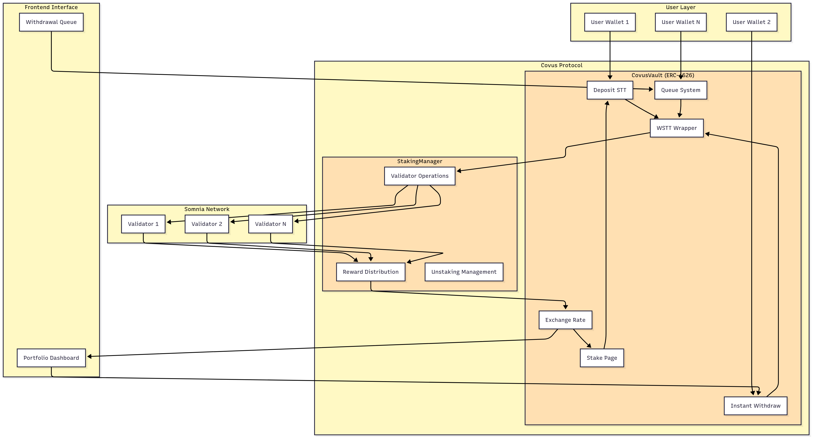

# Covus - Liquid Staking Protocol

A decentralized liquid staking protocol, allowing users to stake STT and receive liquid csSTT tokens representing their staked position.

## 🏗️ Architecture



### Core Components

- **CovusVault**: ERC-4626 compliant vault that manages deposits, withdrawals, and share accounting
- **StakingManager**: Mock validator operator for simulating ETH2 staking operations
- **MockWSTT**: Wrapped STT implementation for local testing
- **Withdrawal Queue**: FIFO queue system for handling withdrawals when liquidity is insufficient

### Key Features

- ✅ **ERC-4626 Standard**: Compatible with DeFi protocols and aggregators
- ✅ **Instant Withdrawals**: When sufficient liquidity is available
- ✅ **Queued Withdrawals**: FIFO queue for when liquidity is tight
- ✅ **Non-rebasing Shares**: Share value increases via exchange rate appreciation
- ✅ **Mock Staking**: Local simulation of validator operations
- ✅ **Comprehensive Testing**: Full test suite covering all functionality

## 🚀 Quick Start

### Prerequisites

- Node.js >= 20.18.3
- Yarn package manager

### Installation

```bash
# Install dependencies
yarn install

# Start local blockchain
yarn chain

# In a new terminal, deploy contracts
yarn deploy

# In a new terminal, start the frontend
yarn start
```

## 📋 Protocol Flow

### 1. Deposit Phase

- User calls `depositSTT()` with STT
- STT is wrapped to WSTT and deposited into the vault
- User receives csSTT shares based on current exchange rate

### 2. Staking Phase

- Protocol operator calls `stake()` on StakingManager to send WSTT to validators
- StakingManager simulates ETH2 deposits (production: real validator infrastructure)

### 3. Rewards Phase

- Validators earn staking rewards
- Rewards are sent back to the vault as STT
- Exchange rate increases, making each csSTT worth more STT

### 4. Withdrawal Phase

- **Instant**: If sufficient liquidity, user can withdraw immediately
- **Queued**: If insufficient liquidity, withdrawal enters FIFO queue

### 5. Queue Processing

- Keeper or anyone can call `processQueue()` to fulfill queued withdrawals
- Withdrawals are processed in order when liquidity becomes available

## 🧪 Testing

```bash
# Run all tests
yarn test

# Run tests with gas reporting
yarn test --gas
```

### Test Coverage

- ✅ Contract deployment and initialization
- ✅ STT deposits and share minting
- ✅ Reward distribution and exchange rate updates
- ✅ Instant withdrawals (STT and WSTT)
- ✅ Withdrawal queue mechanics
- ✅ StakingManager integration
- ✅ Admin functions
- ✅ Edge cases and security

## 🔧 Development

### Contract Structure

```
contracts/
├── IWETH.sol              # WETH interface
├── MockWSTT.sol           # Mock WSTT for testing
├── CovusVault.sol         # Main vault contract
└── StakingManager.sol     # Mock validator operator
```

### Key Functions

#### User Functions

- `depositSTT(address receiver)` - Deposit STT, receive csSTT
- `withdrawSTT(uint256 assets, uint256 maxShares, address receiver, address owner)` - Instant withdrawal with slippage protection
- `redeemSTT(uint256 shares, uint256 minAssets, address receiver, address owner)` - Instant redemption with slippage protection
- `requestWithdrawal(uint256 shares)` - Queue withdrawal request

#### Admin Functions

- `reportRewards(uint256 amount)` - Record staking rewards
- `unwrapToSTT(uint256 amount)` - Convert WSTT to STT
- `wrapSTT()` - Convert STT to WSTT
- `processQueue(uint256 maxRequests)` - Process queued withdrawals
- `pause()` - Pause all operations
- `unpause()` - Unpause operations
- `setMaxSlippage(uint256 newSlippage)` - Update maximum slippage
- `approveWSTT(address spender, uint256 amount)` - Approve WSTT spending

#### View Functions

- `totalAssets()` - Total vault assets (excluding queued)
- `freeLiquidity()` - Available liquidity for instant withdrawals
- `pendingRequests()` - Number of queued withdrawal requests
- `convertToAssets(uint256 shares)` - Preview STT for shares
- `getCsSTTSTTRate()` - Get current csSTT/STT exchange rate
- `getCsSTTPrice()` - Get csSTT price for external integrations
- `isExchangeRateHealthy()` - Check if exchange rate is healthy
- `isSlippageAcceptable(uint256 shares)` - Check if redemption would exceed slippage limits

## 🌐 Deployment

### Local Development

```bash
yarn deploy
```

### Testnet Deployment

```bash
yarn deploy --network somniaTestnet
```

## 📋 Contract Addresses

### Somnia Testnet (Chain ID: 50312)

- **CovusVault**: `0x4A8C94962Ca9f2eE9312221093be6d5Ef7a334Dc`
- **StakingManager**: `0xfB828C72F2002D58B4a754D2EdaebEDB0Fb6baCa`

## 📊 Protocol Metrics

Track these key metrics:

- `totalAssets()` - Total vault value
- `totalSupply()` - Total csSTT supply
- `getCsSTTSTTRate()` - csSTT to STT conversion rate
- `queuedAssets()` - Assets reserved for queued withdrawals
- `freeLiquidity()` - Available for instant withdrawals
- `pendingRequests()` - Number of queued withdrawal requests

## 🤝 Contributing

1. Fork the repository
2. Create a feature branch
3. Make your changes
4. Add tests for new functionality
5. Submit a pull request

## 📄 License

MIT License - see LICENSE file for details

## 🙏 Acknowledgments

- Built with [Scaffold-ETH 2](https://github.com/scaffold-eth/scaffold-eth-2)
- Inspired by protocols like Lido, RocketPool, and Frax
- Uses OpenZeppelin contracts for security and standards compliance
